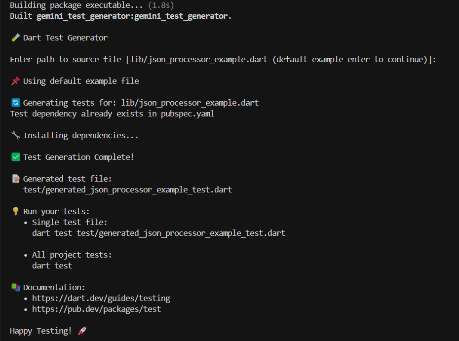

# 🧪 package:coverage + LLM = test generation
## GSoC 2025 Proposal Project

A command-line tool that automatically generates comprehensive unit tests for Dart classes using the Gemini AI API. This project serves as an initial phase demonstration for a Google Summer of Code 2025 (GSoC) proposal, exploring the potential of combining package:coverage insights with Large Language Models (LLMs) for intelligent test generation in Dart.

🔗 [View on GitHub](https://github.com/maajidAwol/dart_test_generator.git)

## 🎯 Current Implementation

This CLI tool currently:
- Generates comprehensive unit tests using Gemini AI
- Handles import management automatically
- Processes test dependencies
- Provides a default example implementation
- Generates well-structured, readable test code

## 📋 Implemented Features

- 🤖 Test generation via Gemini API
- 📝 Follows Dart testing best practices
- 🎯 Generates tests for:
  - Public methods
  - Edge cases
  - Error conditions
  - Boundary values
- 📦 Automatic dependency management:
  - Import resolution
  - Package name detection
  - Test dependency setup

## 🚀 Getting Started

### Prerequisites

- Dart SDK (version 2.12.0 or higher)
- A Gemini API key

### Installation

1. Clone the repository:
```bash
git clone https://github.com/maajidAwol/dart_test_generator.git
cd dart_test_generator
```

2. Install dependencies:
```bash
dart pub get
```

3. Set up your Gemini API key:
   - Open `bin/gemini_test_generator.dart`
   - Replace the `geminiApiKey` constant with your actual API key:
```dart
const String geminiApiKey = 'your-api-key-here';
```

## 💻 Usage

1. Run the generator:
```bash
dart run
```

2. Enter the path to your source file when prompted. The tool comes with a default example:



3. The tool will automatically:
   - Generate comprehensive tests
   - Create a test file in the `test` directory
   - Add necessary dependencies
   - Run `dart pub get`


4. Run the generated tests:
```bash
dart test 
```

Output:
```
Building package executable... (1.5s)
Built test:test.
00:00 +19: All tests passed!
```

## 📝 Examples

### Default Example Implementation
The repository includes several sample test files in the `test` directory that were generated using the Gemini AI API. These serve as real-world examples of the tool's capabilities:

- `test/generated_json_processor_example_test.dart`: Basic JSON processing tests
- `test/generated_json_processor_sample3_test.dart`: Comprehensive test suite with edge cases

These sample tests demonstrate:
- Proper test structure and organization
- Comprehensive edge case handling
- Error condition testing
- Real-world application of testing best practices

### Input: Default Example File
```dart
// lib/json_processor_example.dart
import 'dart:convert';

class JsonProcessor {
  /// Sums the 'value' fields from a JSON string representing a list of objects.
  /// Throws a FormatException if the JSON structure is invalid.
  double sumValues(String jsonString) {
    final List<dynamic> list = jsonDecode(jsonString);
    double sum = 0.0;
    for (var item in list) {
      if (item is Map && item.containsKey('value')) {
        final dynamic value = item['value'];
        if (value is num) {
          sum += value.toDouble();
        } else {
          throw FormatException('Invalid value type');
        }
      } else {
        throw FormatException('Invalid item format');
      }
    }
    return sum;
  }

  /// Multiplies each 'value' in the JSON string by a given factor and returns the results.
  /// Throws a FormatException for invalid JSON structure or value types.
  List<double> multiplyValues(String jsonString, double factor) {
    final List<dynamic> list = jsonDecode(jsonString);
    final List<double> result = [];
    for (var item in list) {
      if (item is Map && item.containsKey('value')) {
        final dynamic value = item['value'];
        if (value is num) {
          result.add(value.toDouble() * factor);
        } else {
          throw FormatException('Invalid value type');
        }
      } else {
        throw FormatException('Invalid item format');
      }
    }
    return result;
  }
}

```

### Output: Generated Test File
```dart
import 'dart:convert';
import 'package:test/test.dart';
import 'package:gemini_test_generator/json_processor_example.dart';

void main() {
  group('JsonProcessor', () {
    late JsonProcessor instance;

    setUp(() {
      instance = JsonProcessor();
    });

    group('sumValues', () {
      test('Normal case: sums values from a valid JSON string', () {
        // Arrange
        const jsonString = '[{"value": 1.0}, {"value": 2.5}, {"value": 3}]';
        const expectedValue = 6.5;

        // Act
        final result = instance.sumValues(jsonString);

        // Assert
        expect(result, closeTo(expectedValue, 0.001));
      });

      test('Edge case: empty list', () {
        // Arrange
        const jsonString = '[]';
        const expectedValue = 0.0;

        // Act
        final result = instance.sumValues(jsonString);

        // Assert
        expect(result, closeTo(expectedValue, 0.001));
      });

      test('Edge case: invalid JSON format', () {
        // Arrange
        const invalidJsonString = '{"value": 1.0';

        // Act & Assert
        expect(
          () => instance.sumValues(invalidJsonString),
          throwsA(isA<FormatException>()),
        );
      });
      // ... more tests
    });
    // ... more groups
  });
}
```

## 🎯 Test Coverage

The generated tests include:

- ✅ Normal cases with valid inputs
- 🔄 Edge cases (empty lists, null values)
- ❌ Error conditions (invalid JSON, wrong types)
- 🎯 Boundary values (zero, negative numbers)
- 📊 Type checking (strings, booleans, null)
- 🧮 Numerical precision tests

## 📚 Generated Test Structure

Each test file follows a consistent structure:

1. **Imports**: Automatically managed based on your package
2. **Main Group**: Named after the class being tested
3. **Setup**: Instance creation in `setUp`
4. **Method Groups**: Separate group for each method
5. **Test Cases**:
   - Normal cases with descriptive names
   - Edge cases with expected exceptions
   - Comprehensive error handling

## ⚙️ Configuration

The tool automatically:

- Creates a `test` directory if needed
- Adds test dependencies to `pubspec.yaml`
- Manages imports correctly
- Handles package names dynamically


## 🔬 Research Goals

This project explores:
- LLM effectiveness in test generation
- Coverage-guided test improvement
- Test quality and coverage metrics
- Developer productivity impact
- Best practices for AI-assisted testing
- Integration with existing tools

## 📈 Evaluation Metrics

The project's success will be measured by:
- Test coverage percentage
- Error detection rate
- False positive/negative rates
- Developer time savings
- Code maintainability impact

## 🙏 Acknowledgments

- Proposed as part of Google Summer of Code 2025 for Dart
- Powered by Google's Gemini AI
- Built with Dart
- Inspired by testing best practices


---
*Note: This is a proof-of-concept implementation for a GSoC 2025 proposal. Features and capabilities may evolve based on project requirements and feedback.*

## 📚 Sample Tests

The repository includes several AI-generated test files that showcase the tool's capabilities:

1. **JSON Processor Tests**
   - Location: `test/generated_json_processor_example1_test.dart`
   - Features:
     - Basic value summation tests
     - JSON parsing validation
     - Error handling cases

2. **Extended Test Suite**
   - Location: `test/generated_json_processor_sample3_test.dart`
   - Features:
     - Comprehensive edge cases
     - Type validation
     - Boundary testing
     - Error condition handling

These sample tests serve as both examples and validation of the tool's effectiveness in generating meaningful, comprehensive test suites.
